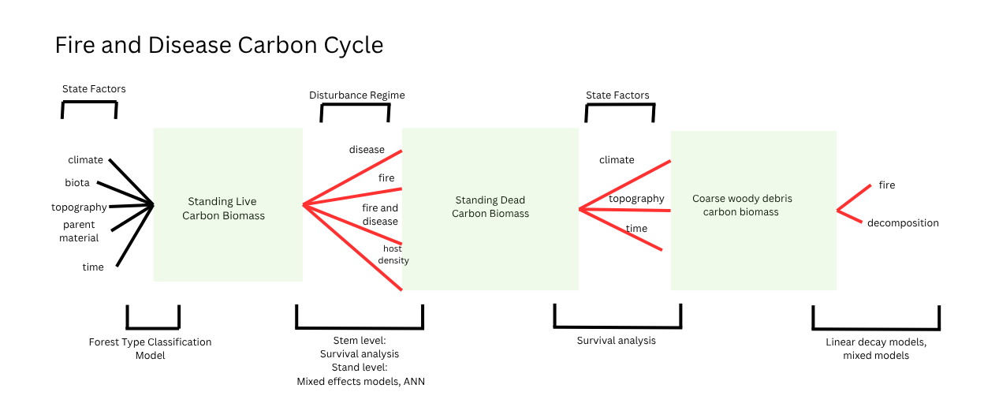

## Sudden oak death biological context  
Key to the findings presented here is the biological basis for the underlying wildfire and disease dynamics. From prior scientific literature, we understand that Phytophora ramorum kills tanoak, which accumulates on the forest floor until it's decomposed or burnt in wildire. We also know that redwood is a dead end host and does not die or spread the disease. Additionally, we understand that bay laurel is an asymptomatic spreader of Phytohpora ramorum and has the competitive advantage in diseased stands. 

**Main research questions**   

i) In diseased stands, when wildfire occurs do we see higher mortality in redwood than in non-diseased stands?    

ii) How does tanoak size interact with pathogen presence to determine mortality rates? Do we see that larger trees die when the pathogen is present?    

    a) How does bay laurel density influence mortality rates?   

iii) How do state factors influence forest type and snag fall rates?    

iv) How does fire and disease influence coarse woody debris mass? How much CWD is burnt in fires? How does pathogen presence impact CWD pools?     

v) Which factors, size, species, or burn status, influence CWD decomposition rates?    

## Fire/disease graphical model    
Through my research, I aim to quantify the fluxes between three main carbon pools -- living biomass, snags and CWD. Below I outline the proposed carbon cycle between these main pools.   

## Hypothesis    

### State factors influence on forest type
- Elevation, precipitation and albedo will be the most important factors in forest type classification.   

### Fluxes influencing living biomass     

**Redwood**   
- There will be a significant relationship between fire, disease status, slope and CWD mass and living biomass.    

**Tanoak**    
- Disease status, cwd host mass, and Bay laurel density will be significant predictors of living biomass.   
- Tree size will be a strong determinant of living biomass fluxes via pathogen interaction.   

**Bay laurel**    
- Disease status, cwd host mass, and fire will be significant predictors of living biomass.   

