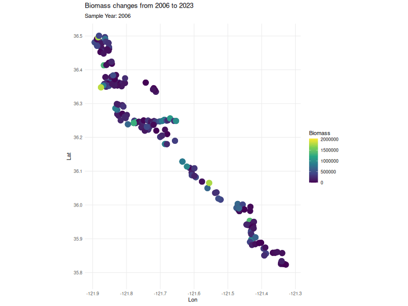
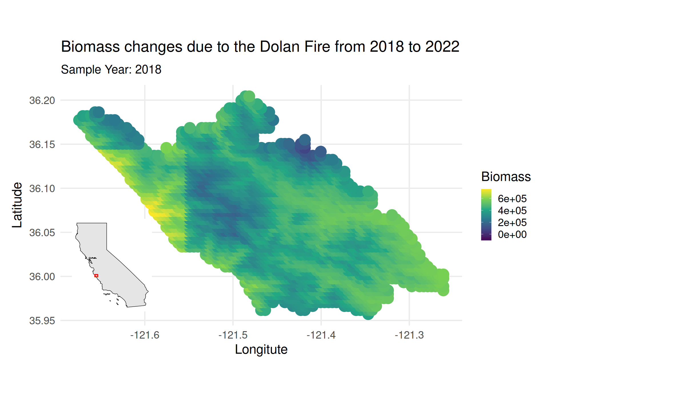

# Carbon Dynamics due to Sudden Oak Death and Fire Interactions in Big Sur   


### Main research questions      

i) How has carbon biomass changed due to fire and disease throughout the inventory? How has species (Tanoak, Coast Live Oak, Redwood, Bay Laurel) density and biomass been altered?    

ii) In diseased stands, when wildfire occurs do we see higher mortality in redwood than in non-diseased stands?    

iii) How does tanoak size interact with pathogen presence to determine mortality rates? Do we see that larger trees die when the pathogen is present?    

      a) How does bay laurel density influence tanoak mortality rates?   

iv) How do state factors influence forest type and snag fall rates?    

v) How does fire and disease influence coarse woody debris mass? How much CWD is burnt in fires? How does pathogen presence impact CWD pools?     

vi) Which factors, size, species, or burn status, influence CWD decomposition rates?   


### Fire/disease graphical model    
Through my research, I aim to quantify the fluxes between three main carbon pools -- living biomass, snags and CWD. Below I outline the proposed carbon cycle between these main pools.   


## Methods      

#### Libraries Needed     

```{r}
library(leaflet)
library(gt)
library(arrow)
library(stringr)
library(broom)
library(gtsummary)
library(survival)
library(ggsurvfit)
library(lme4) 
library(lmerTest)
library(knitr)
library(kableExtra)
library(ggalluvial)
library(tidyverse)
library(bigsurrr)
library(patchwork)
library(furrr)
library(sf)
library(performance)
library(lavaan)
library(bestNormalize)
library(ggridges)
```


### Random Sampling Data Exploration      
Below, I seek to understand the sampling bias throughout the inventory. I use monte carlo simulation to test "randomness" by simulating a random poisson distribution and compare z-scores between our dataset and the simulated dataset.    


```{r}
bias <- read_parquet("./data/arrow/monte.parquet")
z_score <- function(df,x){
  df1 <- df |>
    summarize(
      pop_mean <- mean({{x}}, na.rm=TRUE),
      pop_sd <- sd({{x}}, na.rm=TRUE)) |>
        rename(Mean = 1, Sd = 2) 
  df <- df |>
    mutate(ZScore = ({{x}} - df1$Mean)/ df1$Sd)
  return(df)
}
#sd = 2.311 mean=3.21 
# plotted bias histogram to verify Poisson distribution
bias_mod1 <- z_score(bias, TotalTimesInventoried)

# simulate poisson distribution 280 total, mean of 3.2
set.seed(331)
sim <- data.frame(Simulated = rpois(280,3.2)) 
sim_mod1 <- z_score(sim,Simulated)

# simulated zscore dataset is slightly right skewed, project dataset is heavily right skewed
# simulated zscore dataset has no values over ~3 while project dataset has values near 4
# radius is built on times inventoried
# color will be built on z-score
# project dataset, if z-score < -0.5 they get green
# if z-score > 3 they get red
# use of binning 3
bias_mod2 <- bias_mod1 |>
  mutate(Color = case_when(
                           ZScore < -0.5 ~ "Green",
                           ZScore > 2.75 ~ "Red",
                           TRUE ~ "Blue"
                           ))

map <- bias_mod2

leaflet(map) %>%
  addTiles() %>%
  addProviderTiles(providers$Esri.WorldImagery) %>%
  setView(lng = mean(map$Lon), lat = mean(map$Lat), zoom = 9) %>%
  addCircleMarkers(
    lng = ~Lon,
    lat = ~Lat,
    radius = ~Radius * 1.2,  # scale up for visibility
    label = ~Plot,
    popup = ~paste0(
      "<b>Plot:</b> ", Plot, "<br>",
      "<b>Times Inventoried:</b> ", TotalTimesInventoried, "<br>",
      "<b>Visit Frequency:</b> ", VisitFrequency
    ),
    color = ~Color,
    fillOpacity = 0.7
  ) |>
  addControl(
    html = "<b style='font-size:12px;'>Bias in Sampling Frequency</b>",
    position = "topright"
  ) 
  

```


```{r}
bias_hist <- bias_mod1 |>
  select(TotalTimesInventoried, ZScore) |>
  rename(Count = TotalTimesInventoried) |>
  mutate(Dataset = "Inventory") 

sim_hist <- sim_mod1 |>
  rename(Count = Simulated) |>
  mutate(Dataset = "Simulated")
comp_hist <- bind_rows(bias_hist,sim_hist)
comp_hist |>
    ggplot(aes(x=ZScore, fill=Dataset)) +
    geom_histogram(bins = 25, color = "white", alpha = 0.6,position = "identity") +
    scale_fill_viridis_d() +
    theme_classic() +
    labs(title="Z-Score Distributions", subtitle="Comparing a Forest Inventory and a Simulated Dataset", y="Count")


```


### Principle Component Analysis     

**Objective**   
- Better understand variability within each dataset  
- Add groups beyond Plot ID to test as random factors 


**Plot Dataset**   

```{r}
#| fig-width: 18
#| fig-height: 8

library(corrr)
make_titles <- function(x){
  # expects a character or factor as an input
  stopifnot(is.character(x) | is.factor(x))
  
  # remove the units at the end of the name
  str_remove(x, pattern = "(g|mm)$") |> 
  # replace all _ with spaces
  str_replace_all(pattern = "_", replacement = " ") |> 
  # remove extra whitespace on left 
  str_trim(side = "both") |> 
  # convert the first letter of each word to upper case
  str_to_title()
}

cor_matrix <- function(df, title) {
  df |>
    select(where(is.numeric)) |>
    correlate(method = "pearson",
            use = "pairwise.complete.obs") |>
    rename(term1 = term) |> 
    pivot_longer(cols = -term1, 
               names_to = "term2", 
               values_to = "correlation") |>
    mutate(
      across(.cols = c(term1, term2), 
           .fns = ~ make_titles(.x)
           )
    ) |> 
    ggplot(mapping = aes(x = term1,
                       y = term2, 
                       fill = correlation)) +
      geom_tile() +
      labs(x = "", 
       y = "", 
       title = paste("Correlation Matrix of:", title), 
       fill = "Correlation"
       ) +
      theme_bw() +
      scale_fill_viridis_c(option = "B")

}

plot_meta <- load_plot()

cor_matrix(plot_meta, "Plot Qualitative Variables")

```


```{r}
#| fig-width: 18
#| fig-height: 10

# only numeric cols, will auto scale, center and return transformed data
pca_me <- function(df) {
  df1 <- df |>
    ungroup() |>
    select(where(is.numeric)) |>
    drop_na() 
  pca <- prcomp(df1, scale. = TRUE, center = TRUE, retx = TRUE)
  
  pca_var <- pca$sdev^2
  propve <- pca_var / sum(pca_var)
  print(summary(pca))

  par(mfrow = c(1,2))
  plot(propve, xlab = "Principal Component",
     ylab = "Proportion of Variance Explained",
     ylim = c(0, 1), type = "b", main = "Scree Plot")
 
  biplot(pca, xlabs=rep("", nrow(df1))) 
  
}


pca_me(plot_meta)


```


**Tree Dataset**

```{r}
#| fig-width: 18
#| fig-height: 10

tree <- load_meta() 

cor_matrix(tree, "Tree Qualitative Variables")

```

```{r}
#| fig-width: 18
#| fig-height: 10
pca_me(tree)
```

**Living Biomass Dataset**

```{r}
#| fig-width: 18
#| fig-height: 10

live <- tree |>
  filter(Status == "L") 

cor_matrix(live, "Living Biomass Qualitative Variables")

```

```{r}
#| fig-width: 18
#| fig-height: 10

pca_me(live)

```

**Standing Dead Biomass**

```{r}
#| fig-width: 18
#| fig-height: 10

dead <- tree |>
  filter(!Status == "L") 

cor_matrix(dead, "Standing Dead Biomass Qualitative Variables")

```

```{r}
#| fig-width: 18
#| fig-height: 10

pca_me(dead)

```


**Coarse woody debris biomass**     


```{r}
#| fig-width: 18
#| fig-height: 10

cwd <- load_cwd() |>
  left_join(load_plot(), by = c("SampleYear", "Plot"), relationship = "many-to-many")
  


cor_matrix(cwd, "CWD Biomass Qualitative Variables")

```

```{r}
#| fig-width: 18
#| fig-height: 10

pca_me(cwd)

```

### Analysis of State Factor's Influence on Forest Type   
Aim to answer:    

**Which state factors drive forest type?**    
**How does logistic regression compare to random forest models?**    

$$
\begin{multline}
\text{Forest Type} \sim \text{Soil Great Group} + \text{SOC 0cm} + \text{SOC (< 10cm)} + \text{SOC (< 30cm)} + \\
\text{Precipitation} + \text{Temperature} + \text{NDVI} + \text{Albedo} +
\text{Plot Aspect} + \text{Elevation} + \text{Slope} + \text{Easting} + \text{Northing}
\end{multline}
$$


#### Logistic Regression    
```{r}
library(car)
library(pROC)
state <- load_plot()

state_model1 <- glm(ForestType ~ grtgroup + b0 + b10 + b30 + Precipitation + Temperature +
                    NDVI + Albedo + Elevation + Slope + Easting + 
                    Northing, data = state, family = "binomial") 

log_vis <- summary(state_model1) 
print(log_vis)
print(vif(state_model1))

log_pred <- predict(state_model1, type = "response")
roc_obj <- roc(state_model1$model$ForestType, log_pred, quiet = TRUE)
auc_val <- as.numeric(auc(roc_obj))
print(paste("ROC: ", round(auc_val, 3)))

plot(roc_obj, main = "ROC:",
     col = "#9370DB", lwd = 3, legacy.axes = TRUE) + theme_bw() 

```

#### Random forest classification model    

```{r}
library(ranger)
library(vip)
vars_used <- c("ForestType","grtgroup","b0","b10","b30","Precipitation",
               "Temperature","NDVI","Albedo","Elevation","Slope","Easting","Northing")

state_cc <- state[complete.cases(state[, vars_used]), ]

set.seed(200)
train_index <- sample(1:nrow(state_cc), 0.8 * nrow(state_cc))
train <- state_cc[train_index, ]
test  <- state_cc[-train_index, ]

rf_model <- ranger(ForestType ~ grtgroup + b0 + b10 + b30 + Precipitation + Temperature +
                    NDVI + Albedo + Elevation + Slope + Easting + 
                    Northing, data = train, 
                   num.trees = 100, 
                    importance = "permutation"
)

prediction <- predict(rf_model, data = test)$predictions

rmse_rf <- sqrt(rf_model$prediction.error) 

accuracy <- mean(prediction == test$ForestType)
print(paste("Accuracy:", accuracy))


p1 <- vip::vip(rf_model) + theme_bw() + labs(title = "Importance index for top covariates predicting forest type")
print(p1)

roc_rf <- roc(test$ForestType, as.numeric(prediction), quiet = TRUE)
auc_rf <- as.numeric(auc(roc_rf))
print(paste("ROC: ", round(auc_rf, 3)))

plot(roc_rf, main = "ROC:",
     col = "#9370DB", lwd = 3, legacy.axes = TRUE)


```

**How do the logistic and Random forest models compare?**   

- Utilizing auc  

```{r}
comps <- tibble(
                   Model = c("Logistic Regression", "Random Forest"),
                             AUC = c(auc_val, auc_rf)) |>
gt() |>
fmt_number(decimals = 2)

comps
```


    

### Understanding stand density and biomass distributions      

##### Across all the data  

```{r}
#| fig-width: 16
#| fig-height: 9 

t <- load_tree() |> filter(Species %in% c("SESE", "LIDE", "QUAG", "UMCA"))
p <- load_plot() |> select(Plot, SampleYear, Elevation, Slope, BurnScar, PRam, Fire, tFire, ForestType)

q <- left_join(t, p, by = c("Plot", "SampleYear")) |> distinct() 

q_sums <- q |>
  
  group_by(Plot, Species, SampleYear, Status, PRam, Fire, ForestType) |>
  mutate(Status = case_when(
                            Status == "L" ~ 0,
                            TRUE ~ 1)) |>
  summarize(TotalStem = n(),
            TotalBiomass = sum(Biomass, na.rm = TRUE)) |>
  distinct() 

no_empty_dis <- q_sums |> filter(TotalStem > 0 & TotalBiomass > 0)

box_cox <- function(dfCol){
  pt <- orderNorm(dfCol)
  
  n <- pt$x.t
  return(n)
}

no_empty_dis$BCTotalBiomass <- box_cox(no_empty_dis$TotalBiomass)
no_empty_dis$BCTotalStem <- box_cox(no_empty_dis$TotalStem)


p_total <- function(df) {
  df |>
   group_by(Plot, SampleYear, ForestType, Status) |>
   summarize(TotalStem = sum(TotalStem, na.rm = TRUE),
             TotalBiomass = sum(TotalBiomass, na.rm = TRUE))

}

totals <- p_total(no_empty_dis)

totals$BCTotalStem <- box_cox(totals$TotalStem) 
totals$BCTotalBiomass <- box_cox(totals$TotalBiomass) 


normal <- function(df, stat, metric_need = TRUE, metric = NULL, status = NULL) {
  
  if (metric_need) {
    df1 <- df |> filter(ForestType == metric & Status == status)
  } else {
    df1 <- df
  }

  stat_vec <- df1 |> pull({{ stat }})
  stat_vec <- na.omit(stat_vec)
  
  a <- df1 |>
    ggplot(aes(x = {{ stat }})) +
    geom_histogram(aes(y = after_stat(density)), fill = "gray80", color = "black") +
    geom_density(color = "darkred", linewidth = 1, adjust = 1) +
    theme_bw() +
    labs(title = "Is the data normal?")

  n_obs <- length(stat_vec)
  
  if (n_obs >= 3 && n_obs <= 5000) {
    b <- shapiro.test(stat_vec)
    p_val_b <- b$p.value
    lbl <- if (p_val_b <= 0.1) "** Not normal" else "* Normally Distributed"
    
    a1 <- a + annotate(
      "text", 
      x = min(stat_vec, na.rm = TRUE), 
      y = Inf, 
      label = paste0(lbl, " (p = ", round(p_val_b, 3), ")"),
      vjust = 2, 
      hjust = 0, 
      size = 4,
      fontface = "bold"
    )
  } else if (n_obs > 5000) {
        
    a1 <- a   
  } else {
    a1 <- a + labs(subtitle = "N < 3: Insufficient data for Shapiro-Wilk test")
  }
 
  a2 <- df1 |>
    ggplot(aes(sample = {{ stat }})) +
    stat_qq() +
    stat_qq_line(color = "darkred", linewidth = 1) +
    theme_bw() +
    labs(title = "Q-Q Plot", x = "Theoretical Quantiles", y = "Sample Quantiles")

  a_final <- a1 / a2
  return(a_final)
}


```

**For live biomass in mixed evergreen forests**   

```{r}
bio <- normal(totals, metric_need = TRUE, metric = 1, status = 0, stat = TotalBiomass)
bio_bc <- normal(totals,  metric_need = TRUE, metric = 1, status = 0, stat = BCTotalBiomass)

bio | bio_bc


```

**For dead biomass in mixed evergreen forests**   

```{r}
bio_dead <- normal(totals,  metric_need = TRUE, metric = 1, status = 1, stat = TotalBiomass)
bio_bc_dead <- normal(totals, metric_need = TRUE, metric = 1, status =  1, stat = BCTotalBiomass)

bio_dead | bio_bc_dead


```

**For living biomass in redwood forests**   

```{r}
bio <- normal(totals, metric_need = TRUE, metric = 2, status = 0, stat = TotalBiomass)
bio_bc <- normal(totals, metric_need = TRUE, metric = 2, status = 0, stat = BCTotalBiomass)

bio | bio_bc


```

**For dead biomass in redwood forests**   

```{r}
bio_dead <- normal(totals, metric_need = TRUE, metric = 2, status = 1, stat = TotalBiomass)
bio_bc_dead <- normal(totals, metric = 2, status = 1, stat = BCTotalBiomass)

bio_dead | bio_bc_dead


```


##### Across snag host biomass        

```{r}
m <- load_meta() |> select(Plot, SampleYear, Snag_Host_Biomass) |>
  select(Plot, SampleYear, Snag_Host_Biomass) |>
  filter(Snag_Host_Biomass > 0)

m$BCHostBiomass <- box_cox(m$Snag_Host_Biomass) 

m_dead    <- normal(m, metric_need = FALSE, stat = Snag_Host_Biomass)
m_bc_dead <- normal(m, metric_need = FALSE, stat = BCHostBiomass)

# Combine side-by-side
m_dead | m_bc_dead


```

##### Across cwd host biomass        

```{r}
m <- load_meta() |> select(Plot, SampleYear, CWD_Host_Biomass) |>
  select(Plot, SampleYear, CWD_Host_Biomass) |>
  filter(CWD_Host_Biomass > 0)

m$BCCWDHostBiomass <- box_cox(m$CWD_Host_Biomass) 

m_dead    <- normal(m, metric_need = FALSE, stat = CWD_Host_Biomass)
m_bc_dead <- normal(m, metric_need = FALSE, stat = BCCWDHostBiomass)

# Combine side-by-side
m_dead | m_bc_dead


```


#### Across redwood biomass   

```{r}
species <- no_empty_dis |>
  select(Plot, Species, SampleYear, Status, ForestType, TotalStem, TotalBiomass) |>
  inner_join(m, by = c("Plot", "SampleYear")) |>
  distinct()


sese <- species |>
 filter(Species == "SESE" & Status == 0)

sese$BCTotalBiomass <- box_cox(sese$TotalBiomass) 

sese_live    <- normal(sese, metric_need = TRUE, metric = 2, status = 0, stat = TotalBiomass)
sese_bc_live <- normal(sese, metric_need = TRUE, metric = 2, status = 0, stat = BCTotalBiomass)

# Combine side-by-side
sese_live | sese_bc_live

```

#### Across LIDE stem densities   

```{r}
lide <- species |>
 filter(Species == "LIDE" & Status == 0) |>
 rename(LideSnagBiomass = TotalBiomass)

lide$BCTotalStem <- box_cox(lide$TotalStem) 
lide$LideSnagBiomassNorm <- box_cox(lide$LideSnagBiomass)

lide_live    <- normal(lide, metric_need = TRUE, metric = 2, status = 0, stat = TotalStem)
lide_bc_live <- normal(lide, metric_need = TRUE, metric = 2, status = 0, stat = BCTotalStem)

# Combine side-by-side
lide_live | lide_bc_live

lide2 <- lide |>
  ungroup() |>
  filter(Status == 0) |>
  select(Plot, SampleYear, PRam, Fire, LideSnagBiomass, LideSnagBiomassNorm) 


```

#### Across UMCA stem densities   

```{r}
umca <- species |>
 filter(Species == "UMCA")

umca$BCTotalStem <- box_cox(umca$TotalStem) 

umca_live    <- normal(umca, metric_need = TRUE, metric = 2, status = 0, stat = TotalStem)
umca_bc_live <- normal(umca , metric_need = TRUE, metric = 2, status = 0, stat = BCTotalStem)

# Combine side-by-side
umca_live | umca_bc_live

umca2 <- umca |>
  ungroup() |>
  filter(Status == 0) |>
  select(Plot, SampleYear, PRam, Fire, TotalStem, BCTotalStem) |>
  rename(UmcaTotalStem = TotalStem, 
         BCUmcaTotalStem = BCTotalStem)

```


#### Final dataset      

**47 unique plots with redwood living biomass data, tanoak snag data and cwd data.**      

```{r}
sese_final <- sese |>
  left_join(umca2, by = c("Plot", "SampleYear", "PRam", "Fire")) |>
  left_join(lide2, by = c("Plot", "SampleYear", "PRam", "Fire")) |>
  ungroup() |>
  mutate(across(c("PRam", "Fire"), as.numeric)) |>
  left_join(p |> select(Plot, Elevation, Slope, BurnScar), 
                        by = "Plot") |>
  rename(CwdHostBiomassNorm = BCCWDHostBiomass,
         SeseBiomassNorm = BCTotalBiomass,
        UmcaStemDensityNorm = BCUmcaTotalStem)

```

### Disease and fire impacts on redwood living biomass  

#### Path Analysis   
Testing the following word equations:

$$
Redwood living biomass = Tanoak Snag Biomass + Cwd Biomass + Fire + Disease + Elevation + Slope 
$$


$$
Tanoak Snag Biomass = Bay Laurel Density + Disease  
$$


$$
Cwd Biomass = Tanoak Snag Biomass + Bay Laurel Density + Fire + Disease
$$


```{r}
#| fig-width: 16
#| fig-height: 9 

intro <- "SeseBiomassNorm ~ CwdHostBiomassNorm + LideSnagBiomassNorm + Fire + PRam + Elevation + Slope
          LideSnagBiomassNorm ~ UmcaStemDensityNorm + PRam 
          CwdHostBiomassNorm ~ UmcaStemDensityNorm + LideSnagBiomassNorm + PRam + Fire
          "

fit <- sem(model = intro, data = sese_final)

library(semPlot)

summary(fit, rsquare = TRUE, fit.measures = TRUE)


png("./exports/sese-path.png", width = 1400, height = 1000, res = 150)
par(mar = c(1, 1, 6, 1)) 

semPaths(fit, what = "est", fade = FALSE, edge.label.cex = 0.8,
         sizeMan = 10,          
         nCharNodes = 0, nCharEdges = 0,
         residuals = TRUE,
         mar = c(6, 6, 8, 6)) 

title("Path analysis quantifying CWD fuels as a mediator for disease driven fire impacts to Redwood biomass", 
      line = 4, cex.main = 0.9)
dev.off()
```


#### Mixed effects modeling  

Using the following word equation:      

$$
Redwood living biomass = Tanoak Snag Biomass + Cwd Biomass + Fire + Disease + Elevation + Slope + (1 | Plot) + (1 |SampleYear)
$$


```{r}
#| fig-width: 16
#| fig-height: 14


bio_mixed <- lmer(
                  SeseBiomassNorm ~ CwdHostBiomassNorm + LideSnagBiomassNorm + Fire + PRam + Elevation + Slope  +
                    (1 | Plot) + (1 |SampleYear),
                  data = sese_final)

summary(bio_mixed)

check_model(bio_mixed)

```

 

##### How do the models compare?    

```{r}
comp_me <- function(m1, m2, title1, title2) {
  df <- data.frame(
                   Model = c(title1, title2),
                   AIC = c(AIC(m1), AIC(m2))) |>
  gt()
  
  return(df)

}


comp_me(m1 = fit, m2 = bio_mixed, title1 = "Path analysis", title2 = "Mixed effects model")

```


#### Survival analysis

Using the following word equation:      

$$
Redwood stem mortality = Tanoak Snag Biomass + Cwd Biomass + DBH + Fire + Disease + Elevation + Slope + t 
$$


```{r}
sese_stem <- t |> filter(Species == "SESE") |>
  rename(status = Mortality) |>
  mutate(status = case_when(
                            status == 0 ~ 1,
                            TRUE ~ 2),
  t = SampleYear - 2006) |>
  select(Plot, Species, SampleYear, DBH, status, t)


sese_plot <- sese_final |> 
  select(Plot, SampleYear, Fire, PRam, CwdHostBiomassNorm, LideSnagBiomassNorm, Elevation,  Slope)


sese_sa <- left_join(sese_plot, sese_stem, by = c("Plot", "SampleYear"))

library(survival)
library(survminer)

f <- Surv(t, status) ~ CwdHostBiomassNorm + LideSnagBiomassNorm + Fire + DBH + PRam + Elevation + Slope

fits <- list(
  exponential   = survreg(f, data = sese_sa, dist = "exponential"),
  weibull       = survreg(f, data = sese_sa, dist = "weibull"),
  lognormal     = survreg(f, data = sese_sa, dist = "lognormal"),
  loglogistic   = survreg(f, data = sese_sa, dist = "loglogistic")
)

aic <- sapply(fits, AIC)
tab <- data.frame(distribution = names(aic), AIC = round(aic, 1))
tab <- tab[order(tab$AIC), ]
tab$delta_AIC <- round(tab$AIC - min(tab$AIC), 1)

tab |>
  gt()

exp_sa <- survreg(f, data = sese_sa, dist = "weibull")


summary(exp_sa) 

sese_sa$PredictedTimeDeath <- predict(exp_sa, newdata = sese_sa, type = "response")


```

### Plot level living biomass changes    

```{r}
#| fig-width: 16
#| fig-height: 9 

t <- load_tree()
p <- load_plot() |> select(Plot, SampleYear, Elevation, Slope, BurnScar, PRam, Fire, tFire, ForestType)

q <- left_join(t, p, by = c("Plot", "SampleYear")) 

q_sums <- q |>
  filter(ForestType == 2) |>
  group_by(Plot, Species, SampleYear, Status, PRam, Fire) |>
  mutate(Status = case_when(
                            Status == "L" ~ 0,
                            TRUE ~ 1)) |>
  summarize(TotalStem = n(),
            TotalBiomass = sum(Biomass, na.rm = TRUE)) |>
  distinct() 


min_max <- function(df) {
  df |>
    group_by(Plot, Species) |>
    filter(SampleYear %in% c(min(SampleYear), max(SampleYear))) |>
    mutate(period = if_else(SampleYear == min(SampleYear), "min", "max")) |>
    ungroup()
}

ts_look <- function(df, species, metric) {
  disease_only <- q_sums |>
    filter(Status == 0 & Fire == 0) 
    
  first_last <- disease_only |>
    filter(PRam == 1) |>
    min_max()
    

  p1 <- first_last |> 
    filter(Species == species) |>
    ggplot(aes(y = period, x = .data[[metric]], fill = period)) +
    geom_density_ridges(alpha = 0.5) +
    scale_fill_viridis_d(option = "C") +
    labs(title = paste("Comparing", metric, "Across", species, "from 1st inventory date to last"), 
                       subtitle = "Only in diseased plots with no fire", 
                       x = metric, y = "Period", color = "Time Period") +
    theme_bw() 

  
  p2 <- disease_only |> 
    filter(Species == species) |>
    ggplot(aes(y = PRam, x = .data[[metric]], fill = PRam)) +
    geom_density_ridges(alpha = 0.5) +
    scale_fill_viridis_d(option = "C") +
    labs(title = paste("Comparing", metric, "Across", species, "with disease presence"), 
                       subtitle = "Only in diseased plots with no fire", 
                       x = metric, y = "Period", color = "Disease") +

    theme_bw() 

  p1 / p2

}
 

ts_look(q_sums, "LIDE", "TotalStem")

l <- q |>
  distinct() |>
  group_by(Plot, ForestType, SampleYear) |>
  summarize(AverageDensity =  n_distinct(StemId, na.rm = TRUE)) |>
  ungroup() |>
  drop_na(ForestType) |>
  mutate(ForestType = case_when(
                                ForestType == 1 ~ "Mixed Evergreen",
                                TRUE ~ "Redwood")) |>
  ggplot(aes(y =  ForestType, x = AverageDensity, fill = ForestType)) +
  geom_density_ridges(rel_min_height = 0.005, scale = 20, alpha = 0.5, quantile_lines = FALSE,
                      calc_ecdf = TRUE,
                      geom = "density_ridges_gradient") +
  scale_fill_viridis_d(option = "C") +
  labs(title = "Comparing Stand Density Across Forest Types", x = "Stand Density", y = "Forest Type",
  color = "Forest Type") +
  theme_bw() 


p <- t |>
  filter(Species %in% c("SESE", "QUAG", "LIDE")) |>
  distinct() |> 
  ggplot(aes(y = Species, x = DBH, color = Species, fill = Species)) +
  geom_density_ridges(scale = 0.6) +
  theme_bw() +
  scale_fill_viridis_d(option = "D") +
  scale_color_viridis_d(option = "D") 


l_sum <- function(df, live = TRUE) {
  if (live == TRUE) {
    df |>
      filter(Status == "L" & Species %in% c('LIDE', 'SESE', 'UMCA', 'QUAG')) |>
      group_by(Plot, SampleYear, Species) |>
      summarize(LiveBiomass = sum(Biomass, na.rm = TRUE) * 20) |>
      group_by(Plot, SampleYear) |>
      mutate(TotalLiveBiomass = sum(LiveBiomass))

  } else {
    df |>
      filter(!Status == "L" & Species %in% c('LIDE', 'SESE', 'UMCA', 'QUAG')) |>
      group_by(Plot, SampleYear, Species) |>
      summarize(SnagBiomass = sum(Biomass, na.rm = TRUE) * 20) |>
      group_by(Plot, SampleYear) |>
      mutate(TotalSnagBiomass = sum(SnagBiomass))

  }

}

live <- l_sum(t)

dead <- l_sum(t, live = FALSE)

standing_bio <- left_join(live, 
                          dead |> select(!TotalSnagBiomass),
                          by = c("Plot", "SampleYear", "Species")
                          ) |>
                mutate(SnagBiomass = replace_na(SnagBiomass, 0)) |>
                left_join(dead |> select(!c(Species,SnagBiomass)),
                          by = c("Plot", "SampleYear")) |>
                distinct()


cwd_bio <- load_meta() |> select(Plot, SampleYear, CWD_Ha_Biomass) 


classes <- left_join(cwd_bio, standing_bio, by = c("Plot", "SampleYear"))


p <-  load_plot()

pools <- classes |>
  left_join(p |> select(Plot, SampleYear, BurnScar, ForestType,
                                        PRam, Fire, tFire), 
            by = c("Plot", "SampleYear"))


```


**How have plot's biomass levels changed from the first to most recent inventory?**     
- **How have biomass levels changed across species?**     

```{r}
library(gganimate)
library(sf)

coords <- bias |>
  select(Plot, Lon, Lat)

bio_ts <- left_join(standing_bio, coords, by = "Plot")


map_sf <- bio_ts |>
    select(Plot, SampleYear, Lon, Lat, TotalLiveBiomass) 
 
p_map <- ggplot(map_sf, aes(x = Lon, y = Lat)) +
  geom_point(aes(color = TotalLiveBiomass), size=5) +
  scale_color_viridis_c(name = "Biomass", option = "D") +
  coord_sf() +
  theme_minimal() +
  labs(title = "Biomass changes from 2006 to 2023",
       subtitle = "Sample Year: {closest_state}") +
  transition_states(SampleYear, transition_length = 1, state_length = 8) +
  ease_aes('linear')

#anim <- animate(p_map, n_frames = 80, fps = 3, width = 800, height = 600,renderer = gifski_renderer())


#anim_save("biomass_animation.gif", animation = anim)
```




```{r}
#| fig-width: 16
#| fig-height: 10

min_max <- bio_ts |>
  group_by(Plot, Species) |>
  filter(SampleYear %in% c(min(SampleYear), max(SampleYear))) |>
  mutate(period = if_else(SampleYear == min(SampleYear), "min", "max")) |>
  ungroup() |>
  select(Plot, Species, period, SampleYear, LiveBiomass, TotalLiveBiomass, Lat, Lon) |>
  pivot_wider(
    names_from = period,
    values_from = c(SampleYear, LiveBiomass, TotalLiveBiomass)
  ) |>
  mutate(
    LiveBiomass_diff = LiveBiomass_max - LiveBiomass_min,
    TotalLiveBiomass_diff = TotalLiveBiomass_max - TotalLiveBiomass_min,
    LiveBiomass_pct_change = (LiveBiomass_diff / LiveBiomass_min) * 100,
    TotalLiveBiomass_pct_change = (TotalLiveBiomass_diff / TotalLiveBiomass_min) * 100
  )

map_sf2 <- min_max |> select(Plot, TotalLiveBiomass_diff, Lat, Lon)

p_map2 <- ggplot(map_sf2, aes(x = Lon, y = Lat)) +
  geom_point(aes(color = TotalLiveBiomass_diff), size=5) +
  scale_color_viridis_c(name = "Biomass", option = "D") +
  coord_sf() +
  theme_bw() +
  labs(title = "Plot Biomass changes from 2006 to 2023") 

p_map2

diff <- min_max |>
  select(Plot, TotalLiveBiomass_min, TotalLiveBiomass_max) |>
  pivot_longer(cols = TotalLiveBiomass_min:TotalLiveBiomass_max, names_to = "Date", values_to = "Biomass") 

diff |>
  ggplot(aes(x = Date, y = Biomass, fill = Date)) +
  geom_boxplot() +
  theme_bw()


anova_diff <- aov(Biomass ~ as.factor(Date), data = diff)
summary(anova_diff)
TukeyHSD(anova_diff)

```

#### Remote Sensing Biomass Mapping     
Using field-measured biomass data, can you build a geospatial model to predict biomass changes due to wildfire?   


$$
Live Biomass (Mg C/ ha) ~ Slope + Elevation + NDVI + Burn Area Index  + Fire Status + (1 | SampleYear) + (1 | Plot)
$$      


```{r}
plot_fire <- load_plot() |> select(Plot, SampleYear, Fire)

ha_bio <- standing_bio |>
  select(Plot, SampleYear, TotalLiveBiomass, TotalSnagBiomass) |>
  left_join(plot_fire, by = c("Plot", "SampleYear")) |>
  distinct()

# n of plots =222
dump <- read_parquet("./data/arrow/bio-remote.parquet") |>
  select(Plot, start_date, elevation, slope, precipitation, temperature_2m_max, NDVI, BAI) |>
  mutate(SampleYear = year(start_date)) |>
  select(!start_date) 
  

# n = 197 plots with remote biomass/remote data
meta_bio <- ha_bio |>
  ungroup() |>
  left_join(
    dump,     by = c("Plot", "SampleYear")
  ) |>
  drop_na() |>
  mutate(Fire = as.factor(Fire))

vars_to_scale <- c('slope', 'elevation', 'precipitation', 'temperature_2m_max', 'NDVI', 'BAI')
meta_bio[vars_to_scale] <- lapply(meta_bio[vars_to_scale], function(x) as.numeric(scale(x)))


bio_model <- lmer(TotalLiveBiomass ~  SampleYear + slope + elevation + precipitation + temperature_2m_max + 
                     NDVI + BAI + Fire + (1 | Plot) + (1 | SampleYear), 
                   data = meta_bio)

meta_bio$predictedBio <- predict(bio_model, newdata = meta_bio)


model_results <- function(df, y, preds, model) {
  rmse_test <- sqrt(mean((y - preds)^2))
  r2_test   <- cor(y, preds)^2
  aic <- AIC(model)
  
  results <- data.frame(
    "RMSE" = round(rmse_test, 3),
    "R-squared" = round(r2_test, 3),
    "AIC" = round(aic, 3),
    check.names = FALSE
  )
  
  resid_vals <- resid(model)
  
  p1 <- df |>
    mutate(resid = y - preds) |>
    ggplot(aes(x = y, y = resid)) +
    geom_point() +
    geom_hline(yintercept = 0, linetype = "dashed", color = "red") +
    labs(x = "Observed", y = "Residuals", title = "Residuals vs Observed") +
    theme_bw()
  
  p2 <- ggplot(data.frame(resid = resid_vals), aes(sample = resid)) +
    stat_qq() +
    stat_qq_line(color = "red") +
    labs(title = "Normal Q-Q") +
    theme_bw()
  
  z <- p1 / p2
  print(z)
  
  print(check_model(model))
  
  return(results)
}


model_results(meta_bio, meta_bio$TotalLiveBiomass,
              meta_bio$predictedBio, bio_model) 
```


```{r}
#| eval: false  

add_model <- function(path) {
  bs_big <- read.csv(path) |>
    mutate(coords = .geo) |>
    mutate(coords = str_extract(coords, "(?<=\\[)[^\\]]+(?=\\])")) |>
    separate_wider_delim(coords, delim = ",", names = c("lon", "lat")) |>
    mutate(across(c(lat, lon), as.numeric)) |>
    mutate(SampleYear = year(start_date)) |>
    select(!start_date) |>
    select(SampleYear, BAI, NDVI, elevation, precipitation, slope,
           temperature_2m_max, lon, lat) |>
    group_by(lon, lat) |>
    mutate(Plot = cur_group_id()) |>
    ungroup() 

    return(bs_big)
}


paths <- c("./data/clean/bs-big3-2006.csv", "./data/clean/bs-big3-2007.csv", "./data/clean/bs-big3-2008.csv", "./data/clean/bs-big3-2009.csv",
           "./data/clean/bs-big3-2010.csv", "./data/clean/bs-big3-2011.csv", "./data/clean/bs-big3-2012.csv", "./data/clean/bs-big3-2013.csv",
           "./data/clean/bs-big3-2014.csv", "./data/clean/bs-big3-2015.csv", "./data/clean/bs-big3-2016.csv", "./data/clean/bs-big3-2017.csv",
           "./data/clean/bs-big3-2018.csv", "./data/clean/bs-big3-2019.csv", "./data/clean/bs-big3-2020.csv",  "./data/clean/bs-big3-2021.csv",
          "./data/clean/bs-big3-2022.csv"

)

meta_big <- future_map(.x = paths, .f = add_model) |> bind_rows() 


# clip by dolan fire
dolan <- st_read("./data/raw/dolan.json")

pts <- st_as_sf(meta_big, coords = c("lon", "lat"), crs = 4326)

dolan <- st_transform(dolan, st_crs(pts))

dolan <- st_make_valid(dolan)
clipped <- st_filter(pts, dolan)


clipped_df <- clipped |> 
  mutate(lon = st_coordinates(clipped)[,1],
         lat = st_coordinates(clipped)[,2]) |> 
  st_drop_geometry() |>
  filter(SampleYear %in% c(2018, 2020,  2022)) |>
  mutate(Fire = case_when(
                          SampleYear < 2020 ~ 0,
                          TRUE ~ 1)) |>
  mutate(Fire = as.factor(Fire))

vars_to_scale <- c('slope', 'elevation', 'precipitation', 'temperature_2m_max', 'NDVI', 'BAI')
clipped_df[vars_to_scale] <- lapply(clipped_df[vars_to_scale], function(x) as.numeric(scale(x)))

clipped_df$predictedBio <- predict(bio_model, newdata = clipped_df, allow.new.levels = TRUE)


map_sf <- clipped_df |>
    select(Plot, SampleYear, lon, lat, predictedBio) 


library(rnaturalearth)  
library(gganimate)


ca_boundary <- ne_states(country = "united states of america", returnclass = "sf") |>
  dplyr::filter(name == "California")

bs_bbox <- st_as_sfc(st_bbox(c(
  xmin = min(map_sf$lon), xmax = max(map_sf$lon),
  ymin = min(map_sf$lat), ymax = max(map_sf$lat)
), crs = st_crs(4326)))

inset_map <- ggplot() +
  geom_sf(data = ca_boundary, fill = "grey90", color = "black", linewidth = 0.3) +
  geom_sf(data = bs_bbox, fill = NA, color = "red", linewidth = 0.8) +
  theme_void() +
  theme(panel.background = element_rect(fill = "white", color = "black"))

inset_grob <- ggplotGrob(inset_map)

lon_range <- range(map_sf$lon)
lat_range <- range(map_sf$lat)
lon_pad <- diff(lon_range) * 0.2  
lat_pad <- diff(lat_range) * 0.3

p_map <- ggplot(map_sf, aes(x = lon, y = lat)) +
  geom_point(aes(color = predictedBio), size = 8) +           
  scale_color_viridis_c(name = "Biomass", option = "D") +
  coord_sf(clip = "off") +
  theme_minimal(base_size = 22) +                              
  theme(plot.margin = margin(t = 20, r = 250, b = 20, l = 20),  
        plot.title = element_text(size = 26, face = "bold"),
        plot.subtitle = element_text(size = 20)) +
  labs(title = "Biomass changes due to the Dolan Fire from 2018 to 2022",
       subtitle = "Sample Year: {closest_state}", x= "Longitute", y = "Latitude") +
  annotation_custom(
    grob = inset_grob,
    xmin = lon_range[1] - lon_pad * 0.1  ,   
    xmax = lon_range[1] + lon_pad ,      
    ymin = lat_range[1],
    ymax = lat_range[1] + lat_pad * 1.5       
    ) +
  transition_states(SampleYear, transition_length = 1, state_length = 2) +
  ease_aes('linear')

anim <- animate(
  p_map,
  n_frames = 30,
  fps = 20,
  width = 2400,    
  height = 1400,
  res = 150,
  renderer = gifski_renderer()
)

anim_save("biomass_animation_fire.gif", animation = anim)

```





### Disease impacts on coarse woody debris 
**Is there higher CWD in diseased stands with no recent fire?**     
- Filter BurnScar == "control", PRam = 1

```{r}
disease <- pools |>
  filter(BurnScar == "control") |>
  distinct() 

disease |>
  ggplot(aes(x = PRam, y = CWD_Ha_Biomass, color = PRam)) +
  geom_boxplot() +
  geom_jitter() +
  theme_bw() +
  scale_color_viridis_d(option = "H") +
  labs(x = "Disease Status", subtitle = "Mg CWD Biomass per hectare", color = "PRam")

disease_model <- lmer(log(CWD_Ha_Biomass) ~ PRam + (1 | SampleYear) + (1 | Plot), data = disease)

summary(disease_model)

disease$predictedCwd <- predict(disease_model, newdata = disease)

model_results(disease, disease$CWD_Ha_Biomass, disease$predictedCwd, disease_model)


```

#### Results    
Disease presence is a significant predictor of CWD biomass in unburnt stands (p = 0.00059). When controlling for plot and year, disease presence yields 0.93 additional Mg CWD biomass per hectare. Normalizing the CWD response variable by taking the natural log reduces AIC from 736 to 189 but RMSE increases and R2 decreases. The diagnostic plots above indicate taking the log of CWD Biomass yields the best model.     


