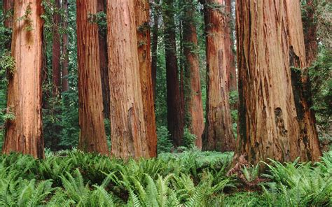
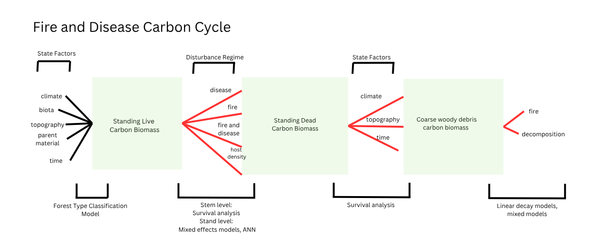

# Carbon Dynamics due to Sudden Oak Death and Fire Interactions in Big Sur   



## Introduction     
**This is subject to change and is used as a placeholder.**   
In the late 1990's, the invasive oomycete pathogen, Phytophthora ramorum, was introduced in CA and has resulted in a widespread epidemic of Sudden Oak Death (SOD). SOD has spread from southern Oregon to the southern Big Sur Coast and has produced novel amounts of tree mortality previously unseen by non-native forest pathogens (Cobb et al., 2020). In conjunction, dead trees have resulted in denser fuel structures, leading to synergistic impacts with both disease and fire combining to reshape native forests (Shaw et al., 2022). I aim to develop a cohesive model describing the fire and disease carbon cycle in three pools: standing live biomass, standing dead biomass (snag) and coarse woody debris (CWD) and the fluxes driving carbon changes between each pool.

### Main research questions      

i) How has carbon biomass changed due to fire and disease throughout the inventory? How has species (Tanoak, Coast Live Oak, Redwood, Bay Laurel) density and biomass been altered?    

ii) In diseased stands, when wildfire occurs do we see higher mortality in redwood than in non-diseased stands?    

iii) How does tanoak size interact with pathogen presence to determine mortality rates? Do we see that larger trees die when the pathogen is present?    

      a) How does bay laurel density influence tanoak mortality rates?   

iv) How do state factors influence forest type and snag fall rates?    

v) How does fire and disease influence coarse woody debris mass? How much CWD is burnt in fires? How does pathogen presence impact CWD pools?     

vi) Which factors, size, species, or burn status, influence CWD decomposition rates?   

vii) Can you build a predictive model using mixed effects models and survival analysis to quantify biomass changes outside of observed values?   


### Fire/disease graphical model    
Through my research, I aim to quantify the fluxes between three main carbon pools -- living biomass, snags and CWD. Below I outline the proposed carbon cycle between these main pools.   




### Hypothesis    

### State factors influence on forest type
- Elevation, precipitation and albedo will be the most important factors in forest type classification.   

### Fluxes influencing living biomass     

**Redwood**   
- There will be a significant relationship between fire, disease status, slope and CWD mass and living biomass.    

**Tanoak**    
- Disease status, cwd host mass, and Bay laurel density will be significant predictors of living biomass.   
- Tree size will be a strong determinant of living biomass fluxes via pathogen interaction.   

**Bay laurel**    
- Disease status, cwd host mass, and fire will be significant predictors of living biomass.   


## Methods      

### Big Sur Forest Inventory    
Data was obtained through joint grant funding from the following universities (possibly more) -- UC Davis, UC Berekely, Cal Poly SLO, Boise State, North Carolina State and University of Georgia. The inventory includes three main datasets:    
    1) Plot attributes dataset which contains data on spatial and temporal elements of plot locations.   
    2) Tree dataset composed of tree measurements corresponding to size and health.    
    3) Coarse woody debris (CWD) dataset composed of woody material over 5cm in diameter found on the forest floor.   

#### Collection Method
Ecological field data collection focused on measuring different elements of Big Sur forests.   
- 280 500m2 fixed-radius plots were established to measure:   
    - Plot topographic features such as elevation,slope,aspect, gps coordinates and disease status.  
    - Diameter at breast height (DBH) of all trees over 1 cm   
        - Additionally trees are assessed for health class (categorical) and status (categorical).   
    - Coarse woody debris (CWD) volume of all woody debris > 5 cm present on the forest floor, additionally CWD is assessed for decay class (categorical).    

#### Datasets 
**Style Guide**    
- Column names cleaned to PascalCase (original case used by UC Davis)   
- Tables formatted with kable   
- Graphs utilize theme_classic (I would have made my own but the function is lengthy and I could not fit it < 6 pages>)   

#### Plot Database
- Each row is when the plot was visited. There are many repeat variables (elevation,slope,burn scar,etc.) however this is the accounting method to track when plots were visitied and how they've changed.   
- Number of columns = 12   
- 2006-2025

#### Variable Descriptions
| \# | Variable Name | Data Type | Role |
|------------------|------------------|------------------|------------------|
| 1 | Plot | Categorical | Unique plot identifier used to track the spatial distribution of the plot, tree and cwd data. |
| 2 | SampleYear | Date | Year plot was inventoried. |
| 3 | Elevation | Numeric | Average elevation in meters of the plot.|
| 4 | Slope | Numeric | Average slope in percent of the plot.|
| 5 | Burn Scar | Categorical | Burn scar that impacted the plot - Chalk (2008), Sobreanes (2016), Dolan (2020). Some plots were burned twice in overlapping burns. Plots that did not burn are called control. |
| 6 | PRam | Categorical Binary| Disease presence within plot (from direct samples of tissue).|
| 7 | Fire | Categorical Binary| Fire presence within plot. For instance, although plots are within the Dolan fire burn scar, pre 2020, they will have Fire = 0. |
| 8 | Easting | Numeric | GPS reading of plot center.|
| 9 | Northing | Numeric | GPS reading of plot center.|

#### Tree Database
- Each row is a tree measurement from when the plot was visited.    
- Number of observations (n) = 116,706    
- Number of columns = 7     
- 2006 - 2025

#### Variable Descriptions
| \# | Variable Name | Data Type | Role |
|------------------|------------------|------------------|------------------|
| 1 | Plot | Categorical | Unique plot identifier used to track the spatial distribution of the plot, tree and cwd data. |
| 2 | SampleYear | Date | Year plot was inventoried. |
| 3 | Species | Categorical | Unique species identifier built off the first two letters of the genus and species. IE. Sequoia sempervirens = SESE|
| 4 | StemId | Numeric | Unique stem id given to each stem.|
| 5 | Status | Categorical | Overall health of the tree - L (live) all the rest (D,M,E,NM) mean dead and are UC Davis jargon |
| 6 | DBH | Numeric | Diameter of the tree at breast height (cm).|


#### Coarse woody debris (CWD) databases  

#### Tbl CWD       
- Each row is a unique CWD stem measured from when the plot was visited. Includes species and other metadata (time stamp, etc.)    
- Number of observations (n) = 1634  
- Number of columns = 6 (only three needed for analysis)     

#### Variable Descriptions
| \# | Variable Name | Data Type | Role |
|------------------|------------------|------------------|------------------|
| 1 | CWD_ID | Numeric | Unique stem id that allows us to track each stem through time. |
| 2 | BSPlotNumber | Numeric | Unique plot identifier used to track the spatial distribution of the plot, tree and cwd data. |
| 3 | PlantSpeciesAcronym | Categorical | Species identifier built off the first two letters of the genus and species. IE. Sequoia sempervirens = SESE.|

#### Tbl CWD Samples     
- Each row is a unique CWD stem measured from when the plot was visited. Includes actual measurements including diameters, volumes and decay class.    
- Number of observations (n) = 3363  
- Number of columns = 17 (only four needed for analysis)     
- 2009-2025  

#### Variable Descriptions
| \# | Variable Name | Data Type | Role |
|------------------|------------------|------------------|------------------|
| 1 | CWD_ID | Numeric | Unique stem id that allows us to track each stem through time. |
| 2 | SampleYear | Date | Year plot was inventoried. |
| 3 | DecayClass | Categorical | Indicates how recently the tree appeared on the forest floor (1=Fresh, 5=Very Decayed)|
| 4 | Volume | Numeric | Total volume (m3) of the stem. |


#### CWD Densities (Cal Poly)
- Each row is an average wood density (g/cm3) for six species across the five decay classes. Data was obtained through experiments by Dr.Cobb (CAFES) and has not been published.      
- Number of observations (n) = 6  
- Number of columns = 6 (will be pivoted to two)     

#### Variable Descriptions
| \# | Variable Name | Data Type | Role |
|------------------|------------------|------------------|------------------|
| 1 | Species | Categorical | Unique species identifier built off the first two letters of the genus and species. IE. Sequoia sempervirens = SESE. |
| 2 | X1 | Numeric | Density (g/cm3) at decay class 1. |
| 3 | X2 | Numeric | Density (g/cm3) at decay class 2. |
| 4 | X3 | Numeric | Density (g/cm3) at decay class 3. |
| 5 | X4 | Numeric | Density (g/cm3) at decay class 4. |
| 6 | X5 | Numeric | Density (g/cm3) at decay class 5. |

#### Libraries Needed     

```{r}
library(leaflet)
library(gt)
library(arrow)
library(stringr)
library(broom)
library(gtsummary)
library(survival)
library(ggsurvfit)
library(lme4) 
library(lmerTest)
library(knitr)
library(kableExtra)
library(ggalluvial)
library(tidyverse)
library(bigsurrr)
```


### Random Sampling Data Exploration      
Below, I seek to understand the sampling bias throughout the inventory. I use monte carlo simulation to test "randomness" by simulating a random poisson distribution and compare z-scores between our dataset and the simulated dataset.    


```{r}
bias <- read_parquet("./data/arrow/monte.parquet")
z_score <- function(df,x){
  df1 <- df |>
    summarize(
      pop_mean <- mean({{x}}, na.rm=TRUE),
      pop_sd <- sd({{x}}, na.rm=TRUE)) |>
        rename(Mean = 1, Sd = 2) 
  df <- df |>
    mutate(ZScore = ({{x}} - df1$Mean)/ df1$Sd)
  return(df)
}
#sd = 2.311 mean=3.21 
# plotted bias histogram to verify Poisson distribution
bias_mod1 <- z_score(bias, TotalTimesInventoried)

# simulate poisson distribution 280 total, mean of 3.2
set.seed(331)
sim <- data.frame(Simulated = rpois(280,3.2)) 
sim_mod1 <- z_score(sim,Simulated)

# simulated zscore dataset is slightly right skewed, project dataset is heavily right skewed
# simulated zscore dataset has no values over ~3 while project dataset has values near 4
# radius is built on times inventoried
# color will be built on z-score
# project dataset, if z-score < -0.5 they get green
# if z-score > 3 they get red
# use of binning 3
bias_mod2 <- bias_mod1 |>
  mutate(Color = case_when(
                           ZScore < -0.5 ~ "Green",
                           ZScore > 2.75 ~ "Red",
                           TRUE ~ "Blue"
                           ))

map <- bias_mod2

leaflet(map) %>%
  addTiles() %>%
  addProviderTiles(providers$Esri.WorldImagery) %>%
  setView(lng = mean(map$Lon), lat = mean(map$Lat), zoom = 9) %>%
  addCircleMarkers(
    lng = ~Lon,
    lat = ~Lat,
    radius = ~Radius * 1.2,  # scale up for visibility
    label = ~Plot,
    popup = ~paste0(
      "<b>Plot:</b> ", Plot, "<br>",
      "<b>Times Inventoried:</b> ", TotalTimesInventoried, "<br>",
      "<b>Visit Frequency:</b> ", VisitFrequency
    ),
    color = ~Color,
    fillOpacity = 0.7
  ) |>
  addControl(
    html = "<b style='font-size:12px;'>Bias in Sampling Frequency</b>",
    position = "topright"
  ) 
  

```


```{r}
bias_hist <- bias_mod1 |>
  select(TotalTimesInventoried, ZScore) |>
  rename(Count = TotalTimesInventoried) |>
  mutate(Dataset = "Inventory") 

sim_hist <- sim_mod1 |>
  rename(Count = Simulated) |>
  mutate(Dataset = "Simulated")
comp_hist <- bind_rows(bias_hist,sim_hist)
comp_hist |>
    ggplot(aes(x=ZScore, fill=Dataset)) +
    geom_histogram(bins = 25, color = "white", alpha = 0.6,position = "identity") +
    scale_fill_viridis_d() +
    theme_classic() +
    labs(title="Z-Score Distributions", subtitle="Comparing a Forest Inventory and a Simulated Dataset", y="Count")


```


### Principle Component Analysis     

**Objective**   
- Better understand variability within each dataset  
- Add groups beyond Plot ID to test as random factors 


**Plot Dataset**   

```{r}
#| fig-width: 18
#| fig-height: 8

library(corrr)
make_titles <- function(x){
  # expects a character or factor as an input
  stopifnot(is.character(x) | is.factor(x))
  
  # remove the units at the end of the name
  str_remove(x, pattern = "(g|mm)$") |> 
  # replace all _ with spaces
  str_replace_all(pattern = "_", replacement = " ") |> 
  # remove extra whitespace on left 
  str_trim(side = "both") |> 
  # convert the first letter of each word to upper case
  str_to_title()
}

cor_matrix <- function(df, title) {
  df |>
    select(where(is.numeric)) |>
    correlate(method = "pearson",
            use = "pairwise.complete.obs") |>
    rename(term1 = term) |> 
    pivot_longer(cols = -term1, 
               names_to = "term2", 
               values_to = "correlation") |>
    mutate(
      across(.cols = c(term1, term2), 
           .fns = ~ make_titles(.x)
           )
    ) |> 
    ggplot(mapping = aes(x = term1,
                       y = term2, 
                       fill = correlation)) +
      geom_tile() +
      labs(x = "", 
       y = "", 
       title = paste("Correlation Matrix of:", title), 
       fill = "Correlation"
       ) +
      theme_bw() +
      scale_fill_viridis_c(option = "B")

}

plot_meta <- load_plot()

cor_matrix(plot_meta, "Plot Qualitative Variables")

```


```{r}
#| fig-width: 18
#| fig-height: 10

# only numeric cols, will auto scale, center and return transformed data
pca_me <- function(df) {
  df1 <- df |>
    ungroup() |>
    select(where(is.numeric)) |>
    drop_na() 
  pca <- prcomp(df1, scale. = TRUE, center = TRUE, retx = TRUE)
  
  pca_var <- pca$sdev^2
  propve <- pca_var / sum(pca_var)
  print(summary(pca))

  par(mfrow = c(1,2))
  plot(propve, xlab = "Principal Component",
     ylab = "Proportion of Variance Explained",
     ylim = c(0, 1), type = "b", main = "Scree Plot")
 
  biplot(pca, xlabs=rep("", nrow(df1))) 
  
}


pca_me(plot_meta)


```


**Tree Dataset**

```{r}
#| fig-width: 18
#| fig-height: 10

tree <- load_meta() 

cor_matrix(tree, "Tree Qualitative Variables")

```

```{r}
#| fig-width: 18
#| fig-height: 10
pca_me(tree)
```

**Living Biomass Dataset**

```{r}
#| fig-width: 18
#| fig-height: 10

live <- tree |>
  filter(Status == "L") 

cor_matrix(live, "Living Biomass Qualitative Variables")

```

```{r}
#| fig-width: 18
#| fig-height: 10

pca_me(live)

```

**Standing Dead Biomass**

```{r}
#| fig-width: 18
#| fig-height: 10

dead <- tree |>
  filter(!Status == "L") 

cor_matrix(dead, "Standing Dead Biomass Qualitative Variables")

```

```{r}
#| fig-width: 18
#| fig-height: 10

pca_me(dead)

```


**Coarse woody debris biomass**     


```{r}
#| fig-width: 18
#| fig-height: 10

cwd <- load_cwd() |>
  left_join(load_plot(), by = c("SampleYear", "Plot"), relationship = "many-to-many")
  


cor_matrix(cwd, "CWD Biomass Qualitative Variables")

```

```{r}
#| fig-width: 18
#| fig-height: 10

pca_me(cwd)

```

### Analysis of State Factor's Influence on Forest Type   
Aim to answer:    

**Which state factors drive forest type?**    
**How does logistic regression compare to random forest models?**    

$$
\begin{multline}
\text{Forest Type} \sim \text{Soil Great Group} + \text{SOC 0cm} + \text{SOC (< 10cm)} + \text{SOC (< 30cm)} + \\
\text{Precipitation} + \text{Temperature} + \text{NDVI} + \text{Albedo} +
\text{Plot Aspect} + \text{Elevation} + \text{Slope} + \text{Easting} + \text{Northing}
\end{multline}
$$


#### Logistic Regression    
```{r}
library(car)
library(pROC)
state <- load_plot()

state_model1 <- glm(ForestType ~ grtgroup + b0 + b10 + b30 + Precipitation + Temperature +
                    NDVI + Albedo + Elevation + Slope + Easting + 
                    Northing, data = state, family = "binomial") 

log_vis <- summary(state_model1) 
print(log_vis)
print(vif(state_model1))

log_pred <- predict(state_model1, type = "response")
roc_obj <- roc(state_model1$model$ForestType, log_pred, quiet = TRUE)
auc_val <- as.numeric(auc(roc_obj))
print(paste("ROC: ", round(auc_val, 3)))

plot(roc_obj, main = "ROC:",
     col = "#9370DB", lwd = 3, legacy.axes = TRUE) + theme_bw() 

```

#### Random forest classification model    

```{r}
library(ranger)
library(vip)
vars_used <- c("ForestType","grtgroup","b0","b10","b30","Precipitation",
               "Temperature","NDVI","Albedo","Elevation","Slope","Easting","Northing")

state_cc <- state[complete.cases(state[, vars_used]), ]

set.seed(200)
train_index <- sample(1:nrow(state_cc), 0.8 * nrow(state_cc))
train <- state_cc[train_index, ]
test  <- state_cc[-train_index, ]

rf_model <- ranger(ForestType ~ grtgroup + b0 + b10 + b30 + Precipitation + Temperature +
                    NDVI + Albedo + Elevation + Slope + Easting + 
                    Northing, data = train, 
                   num.trees = 100, 
                    importance = "permutation"
)

prediction <- predict(rf_model, data = test)$predictions

rmse_rf <- sqrt(rf_model$prediction.error) 

accuracy <- mean(prediction == test$ForestType)
print(paste("Accuracy:", accuracy))


p1 <- vip::vip(rf_model) + theme_bw() + labs(title = "Importance index for top covariates predicting forest type")
print(p1)

roc_rf <- roc(test$ForestType, as.numeric(prediction), quiet = TRUE)
auc_rf <- as.numeric(auc(roc_rf))
print(paste("ROC: ", round(auc_rf, 3)))

plot(roc_rf, main = "ROC:",
     col = "#9370DB", lwd = 3, legacy.axes = TRUE)


```

**How do the logistic and Random forest models compare?**   

- Utilizing auc  

```{r}
comps <- tibble(
                   Model = c("Logistic Regression", "Random Forest"),
                             AUC = c(auc_val, auc_rf)) |>
gt() |>
fmt_number(decimals = 2)

comps
```


### Plot level biomass changes    

```{r}
#| fig-width: 16
#| fig-height: 9 

t <- load_tree()

l_sum <- function(df, live = TRUE) {
  if (live == TRUE) {
    df |>
      filter(Status == "L" & Species %in% c('LIDE', 'SESE', 'UMCA', 'QUAG')) |>
      group_by(Plot, SampleYear, Species) |>
      summarize(LiveBiomass = sum(Biomass, na.rm = TRUE) * 20) |>
      group_by(Plot, SampleYear) |>
      mutate(TotalLiveBiomass = sum(LiveBiomass))

  } else {
    df |>
      filter(!Status == "L" & Species %in% c('LIDE', 'SESE', 'UMCA', 'QUAG')) |>
      group_by(Plot, SampleYear, Species) |>
      summarize(SnagBiomass = sum(Biomass, na.rm = TRUE) * 20) |>
      group_by(Plot, SampleYear) |>
      mutate(TotalSnagBiomass = sum(SnagBiomass))

  }

}

live <- l_sum(t)

dead <- l_sum(t, live = FALSE)

standing_bio <- left_join(live, 
                          dead |> select(!TotalSnagBiomass),
                          by = c("Plot", "SampleYear", "Species")
                          ) |>
                mutate(SnagBiomass = replace_na(SnagBiomass, 0)) |>
                left_join(dead |> select(!c(Species,SnagBiomass)),
                          by = c("Plot", "SampleYear")) |>
                distinct()


cwd_bio <- load_meta() |> select(Plot, SampleYear, CWD_Ha_Biomass) 


classes <- left_join(cwd_bio, standing_bio, by = c("Plot", "SampleYear"))

classes |>
  select(Plot, SampleYear, CWD_Ha_Biomass, TotalLiveBiomass, TotalSnagBiomass) |>
  pivot_longer(cols = CWD_Ha_Biomass:TotalSnagBiomass, names_to = "Type", values_to = "Biomass") |>
  ggplot(aes(x = Biomass)) +
  geom_histogram() +
  facet_wrap(~Type, scales = "free_x") + 
  theme_bw()

classes |>
  pivot_longer(cols = c(CWD_Ha_Biomass, TotalLiveBiomass,TotalSnagBiomass), names_to = "Type", values_to = "Biomass") |>
  drop_na()|>
  ggplot(aes(x = Biomass, fill = Species)) +
  geom_histogram(position = "stack", alpha = 0.5) +
  facet_wrap(~Type, scales = "free_x") + 
  theme_bw()


classes |>
  select(Plot, SampleYear, CWD_Ha_Biomass, TotalLiveBiomass, TotalSnagBiomass) |>
  mutate(across(c(CWD_Ha_Biomass, TotalLiveBiomass, TotalSnagBiomass), 
                ~log1p(.x), 
                .names = "Log{.col}")) |>
  distinct() |>
  pivot_longer(cols = LogCWD_Ha_Biomass:LogTotalSnagBiomass, names_to = "Type", values_to = "Biomass") |>
  ggplot(aes(x = SampleYear, y = Biomass, color = Type)) +
  geom_point() +
  geom_smooth(method = "loess") +
  theme_bw()

```


